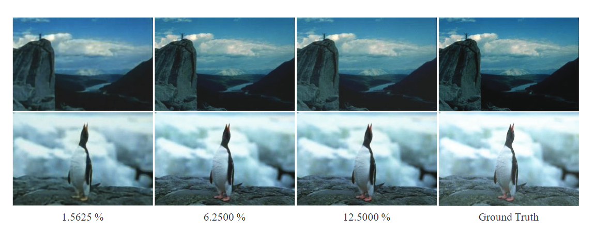

# Runge-Kutta Convolutional Compressed Sensing Network

Source code of ***Sequential Convolution and Runge-Kutta Residual Architecture for Image Compressed Sensing***, in European Conference on Computer Vision (**ECCV**), 2020.



## Abstract
In recent years, Deep Neural Networks (DNN) have empowered Compressed Sensing (CS) substantially and have achieved high reconstruction quality and speed far exceeding traditional CS methods. However, there are still lots of issues to be further explored before it can be practical enough. There are mainly two challenging problems in
CS, one is to achieve efficient data sampling, and the other is to reconstruct images with high-quality. To address the two challenges, this paper proposes a novel Runge-Kutta Convolutional Compressed Sensing Network (RK-CCSNet). In the sensing stage, RK-CCSNet applies Sequential Convolutional Module (SCM) to gradually compact measurements through a series of convolution filters. In the reconstruction stage, RK-CCSNet establishes a novel Learned Runge-Kutta Block (LRKB) based on the famous Runge-Kutta methods, reformulating the process of image reconstruction as a discrete dynamical system. Finally, the implementation of RK-CCSNet achieves state-of-the-art performance on influential benchmarks with respect to prestigious baselines.

## Data Preparation

BSDS datasets can be download from https://www2.eecs.berkeley.edu/Research/Projects/CS/vision/grouping/resources.html.

Once finished downloading, extract the training and validation dataset to ./BSDS500/train and ./BSDS500/val.

## Run the code

Simply run the code with:

```
python train.py --model rkccsnet --sensing-rate 0.5
```

to reproduce the results in the paper.

## Citation

Please cite with the below bibTex if you find it helpful to your research.

```
@inproceedings{zheng2020sequential,
  title={Sequential Convolution and Runge-Kutta Residual Architecture for Image Compressed Sensing},
  author={Zheng, Runkai and Zhang, Yinqi and Huang, Daolang and Chen, Qingliang},
  booktitle={European Conference on Computer Vision},
  pages={232--248},
  year={2020},
  organization={Springer}
}
```
